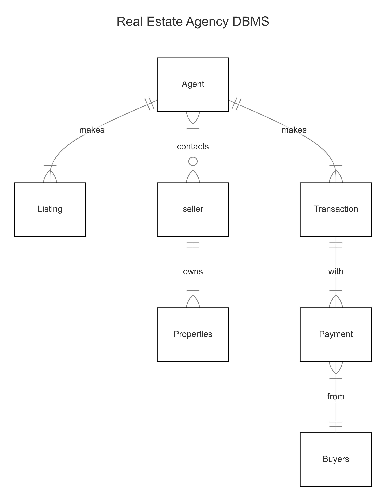

# Design Document

By Olaoluwa Olowokudejo

Video overview: (https://youtu.be/ds0RosYY5UY)

## Scope

This database for Mysql is a designed to help organize transactions, listings and all other operations in a real estate agency.

i have included information about the property, buyer/seller, real estate agent and all transactions related to the listings

Account information of the buyer/seller, history of the property and record of the agent are all outside the scope

## Functional Requirements

In this section you should answer the following questions:

* The user should be able to view buyers, sellers and agents on this database
* They should be able to view listings with the properties and agents associated with them

* user are not able to view the account information of the of other buyers on this database

## Representation

Entities are captured in MySql tables with the following schema.

### Entities

#### users
The users table includes:
* `id` : This is the primary key, it contains the unique identifier for each user
* `username` : this contains the username of users, it is necessary information for login hence it is not null
* `password` : their login password
* `email` : the users email
* `phone_number` : the most recent reachable phone number of the user
* `role` : this signifies the role of the user currently logged into the system, they can be on of three categories('buyers', 'sellers', 'agents')

#### buyers
The buyers table includes:

   * `user_id` : this is a foreign key that references the id in the users table
   * `first_name` : this represents the first name of the buyer
   * `last_name` : this represents the last name of the buyer

#### sellers

The sellers table includes:

   * `user_id` : this is a foreign key that references the id in the users table
   * `first_name` : this represents the first name of the seller
   * `last_name` : this represents the last name of the seller

#### listings
 The listings table includes:

 *    `id` : contains the unique identifier for each listing, this is a primary key
  *  `property_id` : this is a foreign key that references the id of each property in the property table
   * `agent_id` : this is a foreign key that represents the id of each agents from the agent table
    *`price` : this represents the price of the listing
 *   `date` : the date at which the property was listed
  *  `status` : this signifies the staus of the listingit can be available for purchase or sold

#### agents
The agents table includes:

 *   `id` : this is the primary key, it contains the unique identifier for each agent
 *   `user_id` : this is a foreign key referencing the id column from the users table
 *   `first_name` : this represents the first name of the agent
 *   `last_name` : this represents the last name of the agent
 *   `agency_name` : This represents the name of the agency that agent works under
 *   `commission_rate` : representing the standard commission of the agent upon successful sales

#### properties
The properties table includes:

*    `id` : contains the unique identifier for each property
*    `address` : contains the address of the property
*    `city` : contains the city where the property is located
 *   `state` : contains the state where the property is located
  *  `zipcode` : the zipcode of the city or state
*    `square_feet` : contains in 2 decimal places the size in square feets of the property
 *   `bedrooms` : contains the number of bedrooms in the property
  *  `bathrooms` : contains the number of bathrooms in the property
*    `type` : show the type of building i.e residential, commercial, land
 *   `listing_date` : shows the date the property is to be listed

#### transactions
The transactions table includes:

* `id` : contains the unique identifier of each transaction related to the sale and purchase of real estate, this is the primary key
*    `property_id` : this is a foreign key that contains the id of each property from the properties table
*    `buyer_id` : this a foreign key that contains the unique id of a buyer from the buyers table
*    `seller_id` : this a foreign key that contains the unique id of a seller from the sellers table
*    `agent_id` :  this a foreign key that contains the unique id of a agent from the agents table
*    `sale_price` : this shows the selling price on the listing
*    `date` : this contains the date of the transaction
*    `commission` : contains the commission paid to the agent

#### payments
The payments table includes:

*    `id` : this contains the unique identifier of each payment, this is the primary key
*    `transaction_id` : this is a foreign key that references the id of transactions in the transactions table
*    `amount` : this contains the amount of each payment made
*    `date` : contains the date and time of each pyment
*    `type` : show the type of payment that was made eg down payment, commission, closing fee

### Relationships

As detailed by the diagrahm:
* An agent can make one or multiple listings and the agent can also contact zero to many sellers if they have found buyers
* A seller has to own atleast one property but then can also own more than one and a property has to owned by exactly one seller
* An agent can have one to many transactions made up of one to many payments made by a single buyer,
* A buyer can make one to many payments in a a single transaction but a payment can only be made by one buyer

## Optimizations

indexes were create on first and last names of agents, buyers and sellers because it is common to look up peoples involvement with real estate by searching their names

an index was also created on price under the listings table because people commonly use price as a filter when grouping listings

finally there is an index on the amount in the payments table so users can easily arrange transactions based on the amounts payed in said transactions

## Limitations

The current database does not contain personal information about buyers sellers and agents, several tables would need to be altered to contain this information
This schema also doesn't contain the history of the properties being listed
